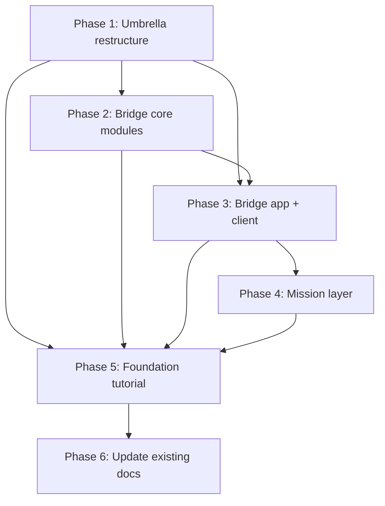

# Plan: Go2 Umbrella Repo + Robot Bridge Foundation

Plan date: 2026-06-20  
Status: drafted, awaiting approval

---

## Goal

Restructure this repo into an **umbrella/monorepo** with a `packages/` directory. Build the
**Robot Bridge foundation libraries as real, installable Python packages** (currently only
described inline in `docs/tutorials/nemo-claw-openclaw/unitree-application/`), move the
gesture demo into its own package, and write a **new English, Go2-only foundation tutorial**
modeled on `basics.md` that teaches building those libraries. Existing `unitree-application/`
phases stay and get cross-linked as the OpenClaw application layer on top.

---

## Decisions (locked)

| #   | Decision                                                  | Rationale                               |
| --- | --------------------------------------------------------- | --------------------------------------- |
| D1  | Umbrella `packages/` monorepo                             | User requirement                        |
| D2  | Gesture + bridge + client as separate full packages       | Clean boundaries; client has no SDK dep |
| D3  | English only, Go2 only                                    | User requirement; drop all G1 content   |
| D4  | Foundation tutorial = new; app phases kept + cross-linked | User requirement                        |
| D5  | Sandbox client as separate `go2-bridge-client` pkg        | Keeps SDK out of sandbox                |
| D6  | Configs as package data inside `go2_robot_bridge/config/` | Self-contained packages                 |
| D7  | Pixi umbrella workspace w/ editable path deps             | Matches existing pixi.toml workflow     |

---

## Target repo layout

```
ts-go2-playground/
├── pixi.toml                          # umbrella workspace
├── README.md                          # umbrella overview (rewrite)
├── PLAN.md                            # this file
├── docs/
│   ├── README.md                      # doc index (update: add foundation row)
│   └── tutorials/
│       ├── nemo-claw-openclaw/
│       │   ├── basics.md              # (unchanged)
│       │   └── unitree-application/
│       │       ├── phase-1-single-call.md        # (add cross-link)
│       │       ├── phase-2-action-sequence.md    # (add cross-link)
│       │       └── phase-3-mission-execution.md  # (add cross-link)
│       └── unitree-go2-foundation/    # NEW
│           └── basics.md
├── packages/
│   ├── go2-gesture-control/           # MOVED: old src/ → here
│   │   ├── pyproject.toml
│   │   ├── README.md
│   │   ├── src/go2_gesture_control/
│   │   │   ├── __init__.py
│   │   │   ├── __main__.py
│   │   │   ├── gesture_detector.py
│   │   │   └── go2_controller.py
│   │   └── models/                    # hand_landmarker.task (downloaded)
│   ├── go2-robot-bridge/             # NEW: host-side foundation
│   │   ├── pyproject.toml
│   │   ├── README.md
│   │   ├── tests/
│   │   │   ├── test_action_library.py
│   │   │   ├── test_safety_supervisor.py
│   │   │   └── test_sdk_adapter.py
│   │   └── src/go2_robot_bridge/
│   │       ├── __init__.py
│   │       ├── app.py                 # FastAPI — all routes
│   │       ├── action_library.py      # loads actions.go2.yaml
│   │       ├── safety_supervisor.py   # limits, confirm, clamp
│   │       ├── sdk_adapter.py         # dry-mode + real SportClient
│   │       ├── mission_library.py     # loads missions.go2.yaml
│   │       ├── mission_supervisor.py  # execute/observe/report
│   │       ├── logger.py              # structured run logger
│   │       └── config/                # Go2-only YAML configs
│   │           ├── actions.go2.yaml
│   │           ├── safety_limits.yaml
│   │           └── missions.go2.yaml
│   └── go2-bridge-client/            # NEW: sandbox-side (NO SDK dep)
│       ├── pyproject.toml
│       ├── README.md
│       └── src/go2_bridge_client/
│           ├── __init__.py
│           └── __main__.py            # list/status/stop/dry-run/run
└── policy/
    └── unitree-robot-bridge.yaml      # NemoClaw network policy (Go2 only)
```

---

## Implementation phases

Each phase is self-contained — a subagent can run one phase per context window.

---

### Phase 1: Umbrella restructure

**Goal**: Convert repo root into umbrella workspace; move gesture demo into its own package.
No net-new code. All existing functionality preserved.

**Steps**:

1.1 Create `packages/go2-gesture-control/pyproject.toml`

- name: `go2-gesture-control`, version `0.1.0`
- deps: `opencv-python >=4.10,<5`, `mediapipe >=0.10.14,<0.11`
- optional dep group `go2`: `unitree_sdk2_python` (git)

  1.2 Create `packages/go2-gesture-control/src/go2_gesture_control/__init__.py` (empty)

  1.3 Move `src/gesture_detector.py` → `packages/go2-gesture-control/src/go2_gesture_control/gesture_detector.py`
  (no content changes — just relocate)

  1.4 Move `src/go2_controller.py` → `packages/go2-gesture-control/src/go2_gesture_control/go2_controller.py`
  (no content changes)

  1.5 Move `src/__main__.py` → `packages/go2-gesture-control/src/go2_gesture_control/__main__.py`
  (update relative import: `from .gesture_detector import` is already correct)

  1.6 Remove `src/` directory (empty `__init__.py` + old files)

  1.7 Rewrite `pixi.toml` root → umbrella workspace

- deps: `python >=3.10,<3.12`, `pip`
- pypi-deps: editable path deps to each package
- tasks: re-point `run`, `dry-run` to new package entrypoints (delegate)
- `install-unitree-sdk` re-pointed or moved to `go2-gesture-control` pkg

  1.8 Verify: `pixi install` + `pixi run dry-run` still works (MediaPipe, no Go2 needed)

**Deliverables**: `packages/go2-gesture-control/` complete; `pixi.toml` updated; `src/` gone.

**Verification**:

- `pixi install` resolves
- `pixi run dry-run` opens webcam/MediaPipe
- `pixi run run` entrypoint exists (real Go2 not needed to verify)

---

### Phase 2: Bridge foundation package — core modules

**Goal**: Create `go2-robot-bridge` package with all core modules (action library, safety
supervisor, SDK adapter, logger) + tests + Go2-only YAML configs. No FastAPI app yet.

**Steps**:

2.1 Create `packages/go2-robot-bridge/pyproject.toml`

- name: `go2-robot-bridge`, version `0.1.0`
- deps: `pyyaml`
- optional dep group `go2`: `unitree_sdk2_python` (git)
- optional dep group `server`: `fastapi`, `uvicorn`, `pydantic`

  2.2 Create `packages/go2-robot-bridge/src/go2_robot_bridge/__init__.py` (empty)

  2.3 Create `packages/go2-robot-bridge/src/go2_robot_bridge/sdk_adapter.py`

- Port from `go2_controller.py` + Phase 1/2 inline code
- `UnitreeGo2Adapter` class: `dry_mode` boolean, real `SportClient` init, methods:
  `status()`, `stop()`, `balance_stand()`, `move(vx,vy,vyaw,duration)` (with `finally: stop()`),
  `stand_up()`, `stand_down()`, `hello()`, `dance1()`, `recovery_stand()`
- dry-mode: return struct dicts, sleep on move, no real SDK import

  2.4 Create `packages/go2-robot-bridge/src/go2_robot_bridge/logger.py`

- Structured logger: `log_event(event, payload)`, timestamped, JSON lines to file

  2.5 Create `packages/go2-robot-bridge/src/go2_robot_bridge/config/actions.go2.yaml`

- Go2-only actions from Phase 2 doc: `go2_status_check`, `go2_stop`, `go2_balance_stand`,
  `go2_forward_short`, `go2_turn_left_short`, `go2_turn_right_short`, `go2_greeting_demo`
- Strip all G1 actions

  2.6 Create `packages/go2-robot-bridge/src/go2_robot_bridge/config/safety_limits.yaml`

- Go2-only limits from Phase 2 doc (vx, vy, vyaw, duration, max_move_steps, rules)
- Strip G1 section

  2.7 Create `packages/go2-robot-bridge/src/go2_robot_bridge/action_library.py`

- `ActionLibrary`: loads YAML, `list_actions()`, `get_action(name)`, raises `KeyError` for unknown

  2.8 Create `packages/go2-robot-bridge/src/go2_robot_bridge/safety_supervisor.py`

- `SafetySupervisor`: `validate_action(name, action, confirmed)`, clamp speed/duration,
  enforce `requires_confirmation`, reject unknown actions

  2.9 Create `packages/go2-robot-bridge/tests/`

- `test_sdk_adapter.py`: dry-mode returns correct structs, move sleeps + auto-stops
- `test_action_library.py`: list returns all actions, get raises KeyError for unknown
- `test_safety_supervisor.py`: confirm rejection, speed/duration clamping, move count enforcement

  2.10 Add `pixi.toml` reference to `go2-robot-bridge` editable dep

  2.11 Verify: `pytest` passes on core modules (no FastAPI, no SDK)

**Deliverables**: `go2-robot-bridge/` package with sdk_adapter, action_library,
safety_supervisor, logger, config YAMLs, tests. No FastAPI app yet.

**Verification**:

- `python -m pytest packages/go2-robot-bridge/tests/` all pass
- dry-mode adapter returns expected dict shapes
- action library loads YAML without error
- safety supervisor rejects unconfirmed motion actions

---

### Phase 3: Bridge FastAPI app + sandbox client

**Goal**: Add FastAPI app (`app.py`) wiring all modules; create `go2-bridge-client`
sandbox-side package; add policy YAML.

**Steps**:

3.1 Create `packages/go2-robot-bridge/src/go2_robot_bridge/app.py`

- FastAPI app wiring all routes from Phase 1 doc → Phase 2 doc
- Routes: `GET /health`, `GET /robot/status`, `POST /robot/stop`, `POST /robot/command`
  (Phase 1), `GET /actions`, `POST /actions/{name}/dry-run`, `POST /actions/{name}/execute`
  (Phase 2), `GET /logs/recent`
- Uses `ActionLibrary`, `SafetySupervisor`, `UnitreeGo2Adapter`, `Logger`
- Execute request model: `confirmed: bool`
- Python API entrypoint: `app` FastAPI instance, plus `create_app()` factory

  3.2 Create `packages/go2-bridge-client/pyproject.toml`

- name: `go2-bridge-client`, version `0.1.0`
- deps: `requests` (NO `unitree_sdk2_python`, NO `fastapi`)

  3.3 Create `packages/go2-bridge-client/src/go2_bridge_client/__init__.py` (empty)

  3.4 Create `packages/go2-bridge-client/src/go2_bridge_client/__main__.py`

- CLI: `python -m go2_bridge_client <command> [args]`
- Commands: `list`, `status`, `stop`, `dry-run <action>`, `run <action> --confirm`,
  `logs`
- Reads `BRIDGE_URL` env var (default `http://127.0.0.1:50001`)
- `run` prints steps and asks for confirmation before POSTing `confirmed: true`

  3.5 Create `policy/unitree-robot-bridge.yaml`

- NemoClaw network policy: allow sandbox→host:50001, method restrictions

  3.6 Add `pixi.toml` ref to `go2-bridge-client` editable dep

  3.7 Verify:

- `uvicorn go2_robot_bridge.app:app --port 50001` starts in dry-mode
- `python -m go2_bridge_client health` → `{"status":"ok"}`
- `python -m go2_bridge_client list` → action list
- `python -m go2_bridge_client dry-run go2_forward_short` → steps display
- `python -m go2_bridge_client run go2_status_check` → executes (no confirm for read-only)

**Deliverables**: Bridge app complete (Phase 1+2 API surface), sandbox client CLI, policy YAML.

**Verification**:

- Bridge server starts, all routes return correct JSON
- Client talks to server, all subcommands work
- Policy YAML is valid and references correct host:port

---

### Phase 4: Mission layer (Phase 3 content)

**Goal**: Add Mission Library and Mission Supervisor to bridge; add mission routes to app;
add `missions` command to sandbox client.

**Steps**:

4.1 Create `packages/go2-robot-bridge/src/go2_robot_bridge/config/missions.go2.yaml`

- Go2-only missions from Phase 3 doc: `go2_demo_patrol`, `go2_inspection_walk`,
  `go2_status_report`
- World State / waypoints embedded (no Nav2/SLAM dependency)
- Strip all G1 missions

  4.2 Create `packages/go2-robot-bridge/src/go2_robot_bridge/mission_library.py`

- `MissionLibrary`: loads `missions.go2.yaml`, `list_missions()`, `get_mission(name)`

  4.3 Create `packages/go2-robot-bridge/src/go2_robot_bridge/mission_supervisor.py`

- `MissionSupervisor`: takes `MissionLibrary`, `ActionLibrary`, `SafetySupervisor`,
  `UnitreeGo2Adapter`, `Logger`
- `execute_mission(name, confirmed)`: run each step, observe, enforce max_duration,
  interrupt on E-stop signal, final report
- `world_state` / `perception_summary` dicts (simple for Phase 3; no real perception)
- `observe(duration)` step: wait + collect status snapshot

  4.4 Add mission routes to `app.py`

- `GET /missions`, `POST /missions/{name}/dry-run`, `POST /missions/{name}/execute`
- Wire with `MissionLibrary` + `MissionSupervisor`

  4.5 Add mission commands to sandbox client `__main__.py`

- `missions` (list), `mission-dry-run <name>`, `mission-run <name> --confirm`

  4.6 Add tests:

- `test_mission_library.py`: list/get, KeyError on unknown
- `test_mission_supervisor.py`: dry-mode execution, confirm rejection, max_duration check

  4.7 Verify:

- `python -m go2_bridge_client missions` → mission list
- `python -m go2_bridge_client mission-dry-run go2_demo_patrol` → steps + waypoints
- `python -m go2_bridge_client mission-run go2_status_report` → executes read-only

**Deliverables**: Mission layer complete; full Phase 1→3 bridge API surface.

**Verification**:

- Bridge serves all mission routes correctly
- Mission supervisor respects max_duration, requires confirmation, auto-stops
- Client mission subcommands functional

---

### Phase 5: Foundation tutorial (English, Go2-only)

**Goal**: Write `docs/tutorials/unitree-go2-foundation/basics.md` — a 3-phase English
tutorial mirroring the structure of `nemo-claw-openclaw/basics.md`, teaching the user to
build and use the packages from Phases 1–4.

**Steps**:

5.1 Create `docs/tutorials/unitree-go2-foundation/` directory

5.2 Write `basics.md` with these sections (matching `basics.md` template style):

**Header**: title, version, scope (Go2 only, English), prereqs (Linux, pixi, wired network 192.168.123.x)

**Phase 1 Beginner — SDK Install & First Connection**

- What You Learn
- Prerequisites (pixi, wired LAN, Go2 powered on)
- Install: `pixi install-unitree-sdk`, network setup (192.168.123.100 PC, 192.168.123.161 Go2)
- First connection: `ChannelFactoryInitialize`, `SportClient` hello world
- Build minimal bridge: dry-run `sdk_adapter.py`, run `app.py`
- First safe commands: `status`, `stop`, `balance_stand`
- Phase 1 Completion Checklist

**Phase 2 Intermediate — Action Library & Safety**

- What You Learn
- Understand Action Library: why fixed actions, not free SDK access
- Create `actions.go2.yaml` and `safety_limits.yaml`
- Build `action_library.py` and `safety_supervisor.py`
- Wire into `app.py`: `/actions`, dry-run, execute with confirmation
- Use sandbox client: `list`, `dry-run`, `run --confirm`
- Test with `go2_forward_short`, `go2_greeting_demo`
- Phase 2 Completion Checklist

**Phase 3 Advanced — Missions & Supervision**

- What You Learn
- Understand Mission vs Action: missions chain actions + observe
- Create `missions.go2.yaml` with waypoints
- Build `mission_library.py` and `mission_supervisor.py`
- Wire into `app.py`: `/missions`, mission dry-run/execute
- Use client: `mission-run go2_demo_patrol --confirm`
- Security posture checklist (physical E-stop, zone limits, max_duration)
- Phase 3 Completion Checklist

**Quick Command Reference** (format matching `basics.md`)
**Official References** (Unitree SDK docs, pixi docs)

5.3 Verify: all code blocks in tutorial match actual package APIs; all `grep -ri g1` → clean.

**Deliverables**: `docs/tutorials/unitree-go2-foundation/basics.md` complete.

**Verification**:

- Markdown renders correctly (checklist tables, code fences, YAML blocks)
- Every terminal command in tutorial copy-pastes successfully
- No G1 strings in file

---

### Phase 6: Update existing docs

**Goal**: Rewrite root `README.md` as umbrella overview; update `docs/README.md`; add
cross-links to unitree-application phases. Content-only — no code.

**Steps**:

6.1 Rewrite root `README.md`

- Umbrella project overview: "Go2 Playground — packages for Go2 gesture control and
  Robot Bridge foundation"
- Link to each package README under `packages/`
- Link to foundation tutorial + application phases
- Remove inline gesture usage (moved to gesture package README)
- Keep pixi install/build instructions at umbrella level

  6.2 Update `docs/README.md`

- Add row for `unitree-go2-foundation/basics.md` in tutorials table
- Note `go2-gesture-control` and `go2-robot-bridge` package READMEs

  6.3 Add cross-links to unitree-application phases (one short note each)

- `phase-1-single-call.md`: "See [Foundation Tutorial](../unitree-go2-foundation/basics.md)
  for building the Robot Bridge foundation used here."
- Same pattern for phase-2, phase-3

  6.4 Verify: all links resolve; no dead references.

**Deliverables**: Updated `README.md`, `docs/README.md`, 3 unitree-application phases.

**Verification**:

- All doc links clickable and resolve
- README accurately describes umbrella structure
- No G1 references remain in edited docs

---

## Phase dependency graph



P1 must run first (umbrella). P2 should run before P3 (core before app). P3 should run
before P4 (mission builds on action routes). P5 can start after P1 but best after P2–P3
to reference real APIs. P6 runs last.

---

## Subagent guidance

Each phase is a self-contained task for a subagent. Pass only the relevant section above
(not the full plan). The subagent does NOT need context from other phases — it works
against the codebase state left by the previous phase.

**Phase file naming** (for subagent handoffs):

- `PLAN.md` ← this file (master plan, never deleted)
- Each subagent reads only its phase block from this file.

**For each subagent invocation**:

- State: "Run Phase N from PLAN.md. Only that phase — do not touch deliverables from other phases."
- Pass: the phase's Steps and Verification blocks.
- The subagent reads source files from the workspace to get current state.
