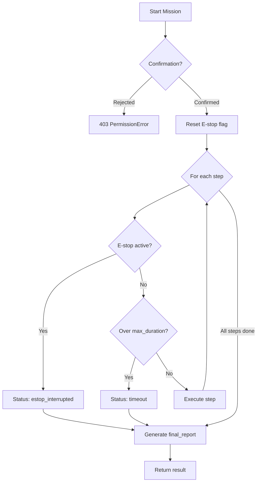

# Unitree Go2 Foundation Tutorial

Version: 2026-06-20
Scope: **Go2 only**. English. G1 is out of scope for this tutorial.

---

## 0. Tutorial Goal

This tutorial is a three-phase learning path that teaches you to build and use the
**Go2 Robot Bridge** foundation packages. By the end you will have a working REST API
server for safe Go2 control and a sandbox-side CLI to talk to it.

| Phase   | Level        | Goal                                                 | Main Result                                                         |
| ------- | ------------ | ---------------------------------------------------- | ------------------------------------------------------------------- |
| Phase 1 | Beginner     | Install SDK, connect to Go2, run first safe commands | Dry-mode bridge server responding to `status` and `stop`            |
| Phase 2 | Intermediate | Build action library with safety enforcement         | `/actions` API with fixed safe actions, sandbox client `list`/`run` |
| Phase 3 | Advanced     | Chain actions into missions with supervision         | `/missions` API with patrol, inspection, and status-report missions |

All packages live under the `packages/` directory in the umbrella monorepo:

```
packages/
├── go2-robot-bridge/   ← host-side FastAPI server (this tutorial builds it)
├── go2-bridge-client/   ← sandbox-side CLI (no SDK dependency)
└── go2-gesture-control/ ← separate gesture demo (not covered here)
```

---

# Phase 1: Beginner — SDK Install & First Connection

## 1.1 What You Learn

By the end of Phase 1, you should be able to:

- install the Unitree SDK2 Python package;
- configure wired network between your PC and Go2;
- start the Robot Bridge server in dry mode (no hardware);
- query `/health`, `/robot/status`, and `/robot/stop`;
- understand the difference between dry mode and real mode.

---

## 1.2 Prerequisites

| Item            | Requirement                                      |
| --------------- | ------------------------------------------------ |
| OS              | Linux (Ubuntu 20.04+ recommended)                |
| Network         | Wired Ethernet, static IP `192.168.123.x` subnet |
| Go2             | Powered on, Ethernet cable connected             |
| Python          | 3.10 or 3.11                                     |
| Package manager | [pixi](https://pixi.sh) (installed in the repo)  |

Check pixi:

```bash
pixi --version
```

Check Python through pixi:

```bash
pixi run python --version
```

---

## 1.3 Network Setup

The Unitree Go2 uses a fixed IP address on its Ethernet port.

| Device         | IP Address                                               |
| -------------- | -------------------------------------------------------- |
| Your PC (host) | `192.168.123.100` (or any `192.168.123.x` except `.161`) |
| Go2 robot      | `192.168.123.161`                                        |

On Ubuntu, configure a static IP:

```bash
# Show available interfaces
ip link show

# Assuming eth0 is the wired interface connected to Go2:
sudo ip addr add 192.168.123.100/24 dev eth0
sudo ip link set eth0 up
```

Verify connectivity:

```bash
ping -c 3 192.168.123.161
```

Expected: 3 replies, 0% packet loss.

---

## 1.4 Install the Unitree SDK

The umbrella workspace includes a task to install the Unitree SDK2 Python package:

```bash
pixi run install-unitree-sdk
```

This installs `unitree_sdk2_python` from the official Unitree Robotics GitHub repository.

Verify the installation:

```bash
pixi run python -c "import unitree_sdk2py; print('SDK OK')"
```

If you see `SDK OK`, the SDK is ready. If you get an `ImportError`, re-run the install task
and confirm your Python version is 3.10 or 3.11.

---

## 1.5 Start the Robot Bridge Server (Dry Mode)

The Robot Bridge server provides a REST API for Go2 control. Start it in **dry mode**
first — no real robot needed, all commands return simulated responses:

```bash
pixi run bridge-server
```

Expected output:

```
INFO:     Started server process
INFO:     Uvicorn running on http://127.0.0.1:50001
INFO:     Application startup complete.
```

Open a second terminal and test the health endpoint:

```bash
pixi run python -m go2_bridge_client health
```

Expected response:

```json
{
  "status": "ok",
  "dry_mode": true
}
```

The `dry_mode: true` field confirms the server is running without real hardware.

---

## 1.6 First Safe Commands

The bridge exposes direct robot commands at `/robot/*`. These are safe in dry mode — they
return simulated responses without touching hardware.

### Check robot status

```bash
pixi run python -m go2_bridge_client status
```

Expected:

```json
{
  "robot": "go2",
  "connected": true,
  "mode": "sport",
  "safe_to_move": true,
  "dry_mode": true
}
```

### Send stop command

```bash
pixi run python -m go2_bridge_client stop
```

Expected:

```json
{
  "executed": "StopMove",
  "dry_mode": true
}
```

### Try the command endpoint (Phase-1 legacy style)

The `/robot/command` endpoint accepts a command name and optional parameters:

```bash
curl -s -X POST http://127.0.0.1:50001/robot/command \
  -H "Content-Type: application/json" \
  -d '{"command": "balance_stand"}'
```

Expected:

```json
{
  "executed": "BalanceStand",
  "dry_mode": true
}
```

Supported commands at `/robot/command`: `status`, `stop`, `balance_stand`, `stand_up`,
`stand_down`, `hello`, `dance1`, `recovery_stand`.

---

## 1.7 Switch to Real Mode (Optional)

> **WARNING**: Only do this when Go2 is physically present, on a flat surface, with
> the emergency stop accessible. Keep the physical remote nearby.

Stop the dry-mode server (Ctrl+C) and start the server forcing real mode.

The `app.py` module uses `UnitreeGo2Adapter(dry_mode=False)` when configured.
To run the server in real mode, set the environment variable:

```bash
export GO2_DRY_MODE=false
```

Then start the server with the Go2 optional dependency:

```bash
pixi run bridge-server
```

Verify real mode:

```bash
pixi run python -m go2_bridge_client health
```

Expected:

```json
{
  "status": "ok",
  "dry_mode": false
}
```

> **Important**: Return to dry mode for all Phase 2 and Phase 3 exercises below.
> Real-mode testing should only happen after you understand the safety system.

---

## 1.8 Phase 1 Completion Checklist

You can move to Phase 2 when all items are true:

- [ ] `pixi run install-unitree-sdk` completes without errors.
- [ ] `ping 192.168.123.161` returns replies (or you are working dry-mode only).
- [ ] `pixi run bridge-server` starts and shows `Uvicorn running on http://127.0.0.1:50001`.
- [ ] `pixi run python -m go2_bridge_client health` returns `{"status":"ok","dry_mode":true}`.
- [ ] `pixi run python -m go2_bridge_client status` returns robot status dict.
- [ ] `pixi run python -m go2_bridge_client stop` returns `{"executed":"StopMove"}`.
- [ ] You understand that `/robot/command` is the Phase-1 low-level interface (not the
      recommended way to control Go2; Phase 2 introduces the safer action library).

---

# Phase 2: Intermediate — Action Library & Safety

## 2.1 What You Learn

By the end of Phase 2, you should be able to:

- understand the action library concept (fixed, pre-defined safe actions);
- read and understand the `actions.go2.yaml` and `safety_limits.yaml` config files;
- use the `/actions` API to list and dry-run actions;
- execute actions with confirmation through the bridge;
- use the sandbox client CLI for `list`, `dry-run`, and `run`;
- understand how the safety supervisor enforces speed limits, duration caps, and
  confirmation requirements.

---

## 2.2 Understand Action Library Philosophy

The Robot Bridge does **not** expose raw SDK calls. Instead, it provides a fixed library
of pre-defined, safe actions. Each action is a named sequence of steps (status check,
move, stop, etc.) with known risk level and confirmation requirements.

**Why fixed actions, not free SDK access?**

| Approach       | Risk                                                      | Safety                                           |
| -------------- | --------------------------------------------------------- | ------------------------------------------------ |
| Raw SDK access | Sandbox could send arbitrary velocities, indefinite moves | ❌ No guardrails                                 |
| Action library | Only listed actions exist; unknown names rejected         | ✅ Speed/duration clamped, confirmation enforced |

The safety system enforces three layers:

1. **Action library** — only known actions exist; `KeyError` for unknown names.
2. **Safety supervisor** — clamps vx/vy/vyaw/duration to max limits, enforces
   confirmation for motion actions, rejects actions with too many move steps.
3. **SDK adapter** — `move()` always calls `StopMove` in a `finally` block; dry mode
   prevents any real hardware interaction.

---

## 2.3 Inspect the Action Definitions

The action library is defined in `packages/go2-robot-bridge/src/go2_robot_bridge/config/actions.go2.yaml`.

Read the file:

```bash
cat packages/go2-robot-bridge/src/go2_robot_bridge/config/actions.go2.yaml
```

Seven actions are defined:

| Action                 | Risk       | Confirm | Description                              |
| ---------------------- | ---------- | ------- | ---------------------------------------- |
| `go2_status_check`     | read_only  | no      | Check status, no motion                  |
| `go2_stop`             | low        | no      | Send StopMove                            |
| `go2_balance_stand`    | low        | no      | Enter balance stand mode                 |
| `go2_forward_short`    | low_motion | yes     | Move forward slowly for 0.8s             |
| `go2_turn_left_short`  | low_motion | yes     | Turn left slowly                         |
| `go2_turn_right_short` | low_motion | yes     | Turn right slowly                        |
| `go2_greeting_demo`    | low_motion | yes     | Small greeting motion: stand, turn, stop |

Each action has a `steps` list. A step is one of: `status`, `stop`, `balance_stand`,
`stand_up`, `stand_down`, `hello`, `dance1`, `recovery_stand`, `move` (with vx/vy/vyaw/duration),
or `wait` (with duration).

---

## 2.4 Inspect the Safety Limits

Safety limits live in `packages/go2-robot-bridge/src/go2_robot_bridge/config/safety_limits.yaml`:

```bash
cat packages/go2-robot-bridge/src/go2_robot_bridge/config/safety_limits.yaml
```

Key limits:

| Limit                       | Value      | Meaning                        |
| --------------------------- | ---------- | ------------------------------ |
| `max_vx`                    | 0.20 m/s   | Max forward speed              |
| `max_vy`                    | 0.10 m/s   | Max lateral speed              |
| `max_vyaw`                  | 0.30 rad/s | Max rotation speed             |
| `max_move_duration`         | 1.0 s      | Max single move duration       |
| `max_move_steps_per_action` | 2          | Max move-type steps per action |

The safety rules also enforce:

- Status check required before and after any motion step.
- `StopMove` required after every move step.
- Human confirmation required for any action containing motion.
- Unknown actions rejected outright.
- Freeform (runtime-constructed) motion rejected.

---

## 2.5 Use the Action API

Make sure the bridge server is running (`pixi run bridge-server` in a terminal).

### List all actions

```bash
pixi run python -m go2_bridge_client list
```

Expected output (7 actions):

```
  go2_status_check                [read_only   ] (no confirm)
    Check Go2 status only. No physical motion.
  go2_stop                        [low         ] (no confirm)
    Send StopMove to Go2.
  go2_balance_stand               [low         ] (no confirm)
    Put Go2 into balance stand mode.
  ...
```

### Dry-run an action (see what it does without executing)

```bash
pixi run python -m go2_bridge_client dry-run go2_forward_short
```

Expected output shows the action's steps with clamped velocities/durations:

```
Action: go2_forward_short
  Description:  Move forward slowly for a short time, then stop.
  Risk:         low_motion
  Confirmation: True
  Steps:
    1. {'type': 'status'}
    2. {'type': 'balance_stand'}
    3. {'type': 'wait', 'duration': 0.5}
    4. {'type': 'move', 'vx': 0.12, 'vy': 0.0, 'vyaw': 0.0, 'duration': 0.8}
    5. {'type': 'stop'}
    6. {'type': 'wait', 'duration': 0.3}
    7. {'type': 'status'}
```

### Execute a read-only action (no confirmation needed)

```bash
pixi run python -m go2_bridge_client run go2_status_check --confirm
```

Expected:

```json
{
  "name": "go2_status_check",
  "status": "completed",
  "duration_s": 0.0,
  "steps": [
    {"type": "status", "result": {"robot": "go2", "connected": true, ...}}
  ]
}
```

### Execute a motion action (confirmation required)

```bash
pixi run python -m go2_bridge_client run go2_greeting_demo
```

The client first shows a dry-run, then prompts:

```
Execute this action? Type 'yes' to confirm:
```

Type `yes` to proceed, or anything else to abort.

> **In dry mode**, the server sleeps for the move duration instead of sending real commands.
> The response will include `"dry_mode": true` in each move result.

### Attempt an unknown action (should be rejected)

```bash
pixi run python -m go2_bridge_client dry-run go2_jump
```

Expected: 404 error — `Unknown action: go2_jump`.

---

## 2.6 Try Without Confirmation (Safety Rejection)

Attempt a motion action without confirmation:

```bash
curl -s -X POST http://127.0.0.1:50001/actions/go2_forward_short/execute \
  -H "Content-Type: application/json" \
  -d '{"confirmed": false}'
```

Expected: 403 error — `Action 'go2_forward_short' requires human confirmation.`

This is the safety supervisor rejecting the unconfirmed motion action. Only actions with
`requires_confirmation: false` (like `go2_status_check` and `go2_stop`) can be executed
without confirmation.

---

## 2.7 What the Safety Supervisor Clamps

If you were to define an action with excessive speed, the safety supervisor would reject it:

```bash
# This would fail — vx 1.5 exceeds max_vx 0.20
curl -s -X POST http://127.0.0.1:50001/actions/go2_forward_short/execute \
  -H "Content-Type: application/json" \
  -d '{"confirmed": true}'
```

The safety supervisor checks every move step before execution:

1. Clamps `vx` to max 0.20, `vy` to max 0.10, `vyaw` to max 0.30.
2. Caps `duration` to max 1.0 second.
3. Rejects actions with more than 2 `move`-type steps.
4. Rejects unconfirmed motion actions.

---

## 2.8 View Bridge Logs

The bridge writes a JSON-lines log file (`bridge_run.log` in the working directory):

```bash
pixi run python -m go2_bridge_client logs
```

Each line is a JSON record with `timestamp`, `event`, and `payload`:

```json
{"timestamp":"2026-06-20T12:00:00.000000+00:00","event":"status_queried","payload":{...}}
{"timestamp":"2026-06-20T12:00:05.000000+00:00","event":"action_start","payload":{"action":"go2_status_check"}}
{"timestamp":"2026-06-20T12:00:05.010000+00:00","event":"step_executed","payload":{"step_type":"status","result":{...}}}
{"timestamp":"2026-06-20T12:00:05.010000+00:00","event":"action_complete","payload":{"action":"go2_status_check","duration_s":0.01}}
```

---

## 2.9 Phase 2 Completion Checklist

You can move to Phase 3 when all items are true:

- [ ] `pixi run python -m go2_bridge_client list` shows all 7 actions.
- [ ] `dry-run go2_forward_short` shows the correct step sequence.
- [ ] `run go2_status_check --confirm` executes successfully.
- [ ] `run go2_greeting_demo` (with confirmation) completes in dry mode.
- [ ] Unconfirmed motion action is rejected with 403.
- [ ] Unknown action name returns 404.
- [ ] `pixi run python -m go2_bridge_client logs` shows recent events.
- [ ] You can explain the three-layer safety model (library → supervisor → adapter).

---

# Phase 3: Advanced — Missions & Supervision

## 3.1 What You Learn

By the end of Phase 3, you should be able to:

- understand the difference between actions and missions;
- read and understand `missions.go2.yaml`;
- use the `/missions` API to list, dry-run, and execute missions;
- use `mission-run` and `mission-dry-run` from the sandbox client;
- understand how the mission supervisor enforces max duration and E-stop;
- apply the security posture checklist before real Go2 missions.

---

## 3.2 Understand Missions vs Actions

| Concept     | Scope                                          | Example                                                    |
| ----------- | ---------------------------------------------- | ---------------------------------------------------------- |
| **Action**  | Single named sequence of steps                 | `go2_forward_short`: status → stand → move → stop          |
| **Mission** | Chains multiple actions + observation + report | `go2_demo_patrol`: actions + observe pauses + final report |

A mission step is one of three types:

| Step Type | Purpose                                                                               |
| --------- | ------------------------------------------------------------------------------------- |
| `action`  | Executes a named action from the Action Library                                       |
| `observe` | Pauses for a duration and collects a perception snapshot (robot status + world state) |
| `report`  | Produces a final structured report (always the last step)                             |

The mission supervisor enforces:

- **Max duration**: if the mission exceeds `max_duration`, it is interrupted with a timeout.
- **E-stop**: if an emergency stop is triggered (via `/robot/stop` or external signal), the
  mission aborts immediately.
- **Confirmation**: missions containing motion require human confirmation, same as actions.

---

## 3.3 Inspect the Mission Definitions

Missions are defined in `packages/go2-robot-bridge/src/go2_robot_bridge/config/missions.go2.yaml`:

```bash
cat packages/go2-robot-bridge/src/go2_robot_bridge/config/missions.go2.yaml
```

Three missions are defined:

| Mission               | Risk       | Confirm | Max Duration | Description                                      |
| --------------------- | ---------- | ------- | ------------ | ------------------------------------------------ |
| `go2_demo_patrol`     | low_motion | yes     | 30s          | Small patrol: stand, move, turn, observe, report |
| `go2_inspection_walk` | low_motion | yes     | 60s          | Inspection walk with waypoints and observations  |
| `go2_status_report`   | read_only  | no      | 10s          | Read-only status check and observation report    |

The `go2_demo_patrol` mission illustrates the structure:

```yaml
missions:
  go2_demo_patrol:
    description: "Small patrol demo..."
    risk: low_motion
    requires_confirmation: true
    max_duration: 30.0
    world_state:
      waypoints:
        - label: "wp_start"
        - label: "wp_mid"
        - label: "wp_end"
    steps:
      - type: action
        name: go2_status_check
      - type: action
        name: go2_balance_stand
      - type: observe
        duration: 1.0
      - type: action
        name: go2_forward_short
      - type: observe
        duration: 1.0
      - type: action
        name: go2_turn_right_short
      - type: observe
        duration: 1.0
      - type: action
        name: go2_forward_short
      - type: observe
        duration: 1.0
      - type: action
        name: go2_turn_left_short
      - type: report
```

---

## 3.4 Use the Mission API

Make sure the bridge server is running.

### List all missions

```bash
pixi run python -m go2_bridge_client missions
```

Expected:

```
  go2_demo_patrol                 [low_motion  ] (confirm)  max 30.0s
    Small patrol demo: check status, stand, move forward, turn, observe, report.
  go2_inspection_walk             [low_motion  ] (confirm)  max 60.0s
    Inspection walk: move to waypoints, observe at each, report back.
  go2_status_report               [read_only   ] (no confirm)  max 10.0s
    Read-only comprehensive status check and observation report.
```

### Dry-run a mission

```bash
pixi run python -m go2_bridge_client mission-dry-run go2_demo_patrol
```

Expected:

```
Mission: go2_demo_patrol
  Description:    Small patrol demo: check status, stand, move forward, turn, observe, report.
  Risk:           low_motion
  Confirmation:   True
  Max Duration:   30.0s
  Steps:
    1. {'type': 'action', 'name': 'go2_status_check'}
    2. {'type': 'action', 'name': 'go2_balance_stand'}
    3. {'type': 'observe', 'duration': 1.0, 'waypoint': None}
    4. {'type': 'action', 'name': 'go2_forward_short'}
    5. {'type': 'observe', 'duration': 1.0, 'waypoint': None}
    ...
```

### Execute a read-only mission (no confirmation needed)

```bash
pixi run python -m go2_bridge_client mission-run go2_status_report --confirm
```

Expected response includes `status: "completed"`, a `final_report` with robot status,
and `duration_s`.

### Execute a motion mission (confirmation required)

```bash
pixi run python -m go2_bridge_client mission-run go2_demo_patrol
```

The client shows a dry-run first, then prompts for confirmation. Type `yes` to proceed.

Expected response (dry mode):

```json
{
  "name": "go2_demo_patrol",
  "status": "completed",
  "duration_s": 6.5,
  "max_duration_s": 30.0,
  "steps": [
    {"type": "action", "name": "go2_status_check", "result": {...}},
    {"type": "action", "name": "go2_balance_stand", "result": {...}},
    {"type": "observe", "summary": {...}},
    ...
  ],
  "final_report": {
    "mission": "go2_demo_patrol",
    "status": "completed",
    "robot_status": {...},
    "world_state": {...}
  }
}
```

### Try without confirmation (rejected)

```bash
curl -s -X POST http://127.0.0.1:50001/missions/go2_demo_patrol/execute \
  -H "Content-Type: application/json" \
  -d '{"confirmed": false}'
```

Expected: 403 — `Mission 'go2_demo_patrol' requires human confirmation.`

---

## 3.5 Understand the Mission Execution Flow

When you execute a mission, the supervisor runs this loop:



Each step type is dispatched:

- **action**: Delegates to `ActionLibrary.get_action()` → `SafetySupervisor.validate_action()` → `UnitreeGo2Adapter`.
- **observe**: `time.sleep(duration)` → collect `robot_status` + `world_state` snapshot.
- **report**: Builds final structured report from all step results + final robot state.

---

## 3.6 Security Posture Checklist

Before running a mission on a real Go2 (not dry mode), verify every item:

- [ ] **Physical E-stop**: accessible and tested (pull to stop).
- [ ] **Remote control**: nearby and paired, ready to override.
- [ ] **Flat surface**: Go2 positioned on level ground, clear area ≥ 2m radius.
- [ ] **Zone limits**: no obstacles, stairs, ledges, or fragile objects within 3m.
- [ ] **Network**: wired connection verified (`ping 192.168.123.161`), no Wi-Fi fallback.
- [ ] **Dry-run first**: `mission-dry-run <name>` reviewed and understood.
- [ ] **Max duration**: mission's `max_duration` appropriate for the space.
- [ ] **Battery**: Go2 battery ≥ 50%.
- [ ] **Observer**: second person present for first real-motion tests.
- [ ] **Stop drill**: both people know `pixi run python -m go2_bridge_client stop` and
      the physical remote override.

---

## 3.7 Phase 3 Completion Checklist

You can consider the tutorial complete when all items are true:

- [ ] `pixi run python -m go2_bridge_client missions` lists all 3 missions.
- [ ] `mission-dry-run go2_demo_patrol` shows the correct step sequence with waypoints.
- [ ] `mission-run go2_status_report --confirm` executes successfully in dry mode.
- [ ] `mission-run go2_demo_patrol` (with confirmation) completes in dry mode.
- [ ] Unconfirmed mission execution is rejected with 403.
- [ ] You can explain the difference between action and mission.
- [ ] You can explain the mission execution loop (E-stop check, max_duration, step dispatch).
- [ ] You have reviewed the security posture checklist.
- [ ] You know how to trigger an emergency stop (`pixi run python -m go2_bridge_client stop`).

---

# Quick Command Reference

## Bridge Server

| Command                  | Purpose                                                    |
| ------------------------ | ---------------------------------------------------------- |
| `pixi run bridge-server` | Start the Robot Bridge FastAPI server on `127.0.0.1:50001` |

## Sandbox Client

| Command                                                             | Purpose                                      |
| ------------------------------------------------------------------- | -------------------------------------------- |
| `pixi run python -m go2_bridge_client health`                       | Check bridge server health                   |
| `pixi run python -m go2_bridge_client status`                       | Get robot status                             |
| `pixi run python -m go2_bridge_client stop`                         | Send emergency stop                          |
| `pixi run python -m go2_bridge_client list`                         | List available actions                       |
| `pixi run python -m go2_bridge_client dry-run <name>`               | Show action steps without executing          |
| `pixi run python -m go2_bridge_client run <name>`                   | Execute an action (prompts for confirmation) |
| `pixi run python -m go2_bridge_client run <name> --confirm`         | Execute an action with explicit confirmation |
| `pixi run python -m go2_bridge_client missions`                     | List available missions                      |
| `pixi run python -m go2_bridge_client mission-dry-run <name>`       | Show mission steps without executing         |
| `pixi run python -m go2_bridge_client mission-run <name>`           | Execute a mission (prompts for confirmation) |
| `pixi run python -m go2_bridge_client mission-run <name> --confirm` | Execute a mission with explicit confirmation |
| `pixi run python -m go2_bridge_client logs`                         | Show recent bridge log lines                 |

## REST API Endpoints

| Method | Path                       | Purpose                                      |
| ------ | -------------------------- | -------------------------------------------- |
| `GET`  | `/health`                  | Server health + dry_mode status              |
| `GET`  | `/robot/status`            | Robot status                                 |
| `POST` | `/robot/stop`              | Emergency stop                               |
| `POST` | `/robot/command`           | Phase-1 single command dispatch              |
| `GET`  | `/actions`                 | List available actions                       |
| `POST` | `/actions/{name}/dry-run`  | Show action steps with clamped values        |
| `POST` | `/actions/{name}/execute`  | Execute action (body: `{"confirmed":bool}`)  |
| `GET`  | `/missions`                | List available missions                      |
| `POST` | `/missions/{name}/dry-run` | Show mission steps                           |
| `POST` | `/missions/{name}/execute` | Execute mission (body: `{"confirmed":bool}`) |
| `GET`  | `/logs/recent?lines=N`     | Last N log lines (default 50)                |

## Pixi Tasks

| Task                           | Purpose                                 |
| ------------------------------ | --------------------------------------- |
| `pixi run install-unitree-sdk` | Install Unitree SDK2 Python from GitHub |
| `pixi run bridge-server`       | Start bridge server                     |
| `pixi run bridge-client`       | Run bridge client (requires subcommand) |

---

# Official References

- [Unitree SDK2 Python](https://github.com/unitreerobotics/unitree_sdk2_python) — official SDK repository
- [Unitree Go2 Documentation](https://support.unitree.com/) — hardware docs, safety guidelines
- [pixi.sh](https://pixi.sh) — pixi package manager documentation
- [FastAPI](https://fastapi.tiangolo.com/) — web framework used by the bridge server
- [Uvicorn](https://www.uvicorn.org/) — ASGI server
